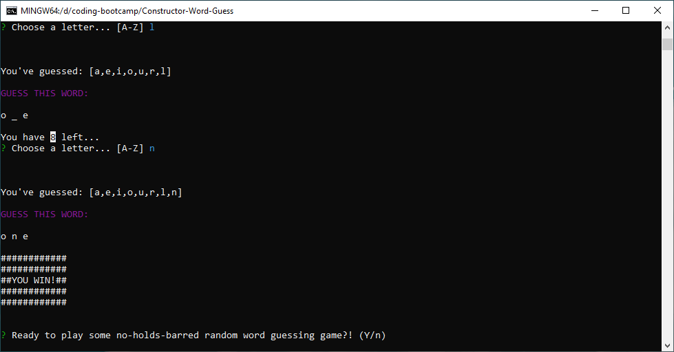

# Constructor-Word-Guess

'Constructor Word Guess' is a hangman-type game where the user must guess letters over 15 rounds in order to succesfully complete and reveal the random word generated by the computer.

This game is made completely in Javascript, and utilizes Node.js and several packages/modules that support the functionality of the interface and game logic.

---

## Technologies Used

- Git
- Javascript
- Node.js
    - *(Node packages: Chalk, Random-words, Inquirer)*

